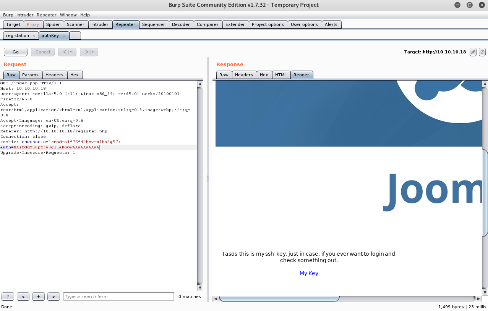

# 	Lazy

 Ein kurzes Tutorial für die Maschine "Lazy" von hackthebox.eu

 https://www.hackthebox.eu/home/machines/profile/18

Die Maschine lehrt den Umgang mit NMAP, Padding Oracle attacks (Umgang mit padbuster) und Authentication Keys.

Einschätzung:

 
## Anleitung

 1. NMAP Scan 

    

 2. Besuch auf Port 80. Registrierung und Login möglich. Bei erfolgreicher Registrierung wird der Nutzer direkt eingeloggt. Außerdem kann der Nutzer "admin" nicht erstellt werden, da dieser bereits vorhanden ist. 

    

 3. Der Benutzer wird nach der Registrierung automatisch eingeloggt. Dies weist darauf hin, dass die Authentifizierung über einen authentification code durchgeführt wird. Der Request wird über Burp analysiert.

    

 4. Der Authentication code wird versucht mit Hilfe von padbuster zu entschlüsseln. PadBuster ist ein Perl-Skript zur Automatisierung von Padding Oracle Attacks. PadBuster bietet die Möglichkeit, beliebigen Chiffriertext zu entschlüsseln, beliebigen Klartext zu verschlüsseln und eine automatisierte Antwortanalyse durchzuführen, um festzustellen, ob eine Anfrage anfällig für Padding-Oracelangriffe ist.

    

 5. Der verschlüsselte authentication code konnte entschlüsselt werden. Nun wird ein Nutzername (admin) in Klartext übergeben und verschlüsselt. 

    

    

 6. Padbuster übergibt einen ciphercode, welcher als authentication code für einen Request in Burp verwendet werden kann.

    

 7. Die Antwort auf den Request kann in den Browser weitergeleitet werden. Dort erhält man die Zugangsdaten und denn Schlüssel für den SSH Zugang.
    
    
