# 	Carrier

 Ein kurzes Tutorial für die Maschine "Carrier" von hackthebox.eu

 https://www.hackthebox.eu/home/machines/profile/155

 Die Maschine lehrt den Umgang mit Dirb (Suche von Unterverzeichnissen und Dateien), Simple Network Management Protocol Requests, Burp, Remote Code Execution Vulnerabilitys und Reverse Shells.  

Einschätzung:

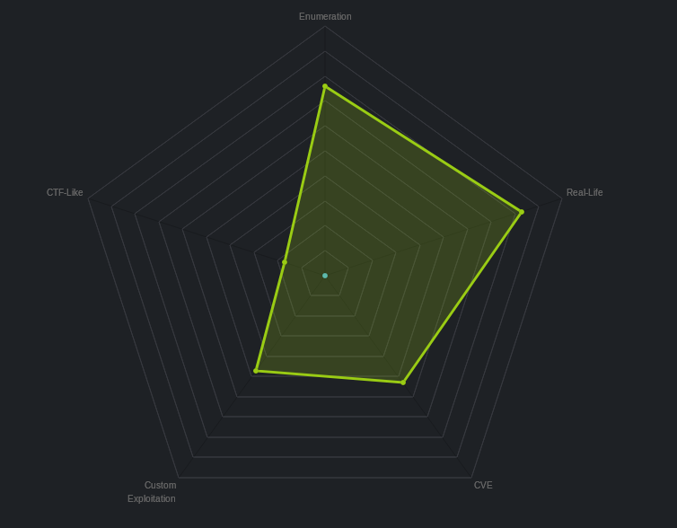
 
## Anleitung

 1. NMAP Scan 

    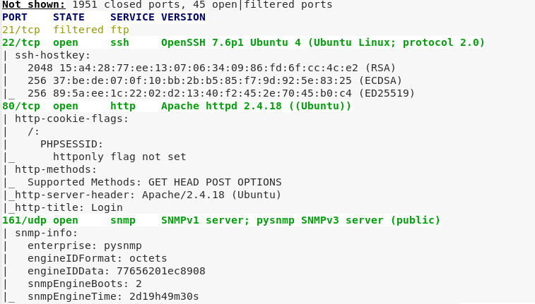

 2. Besuch auf Port 80

    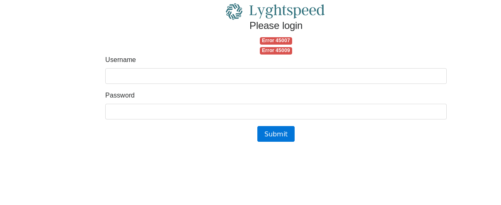

 3. Dirb Scan Resultate (zum Scannen siehe Cheat Sheet)

    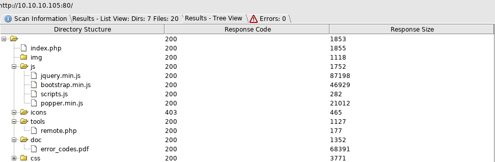

 4. Beim Scannen der Verzeichnisse findet man das Verzeichnis "/doc".  

    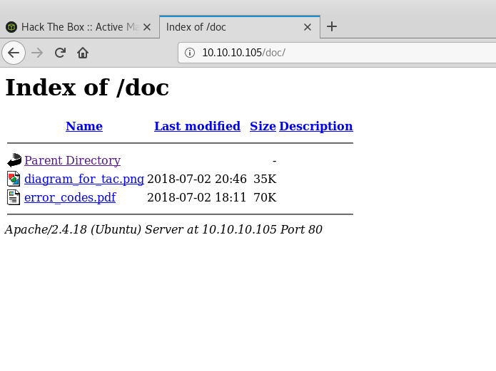

 5. Das Verzeichnis liefert eine interessante Datei mit Fehlercodes. Unter anderem sind hier die Fehlercodes aus der Startseite aufgeführt.

    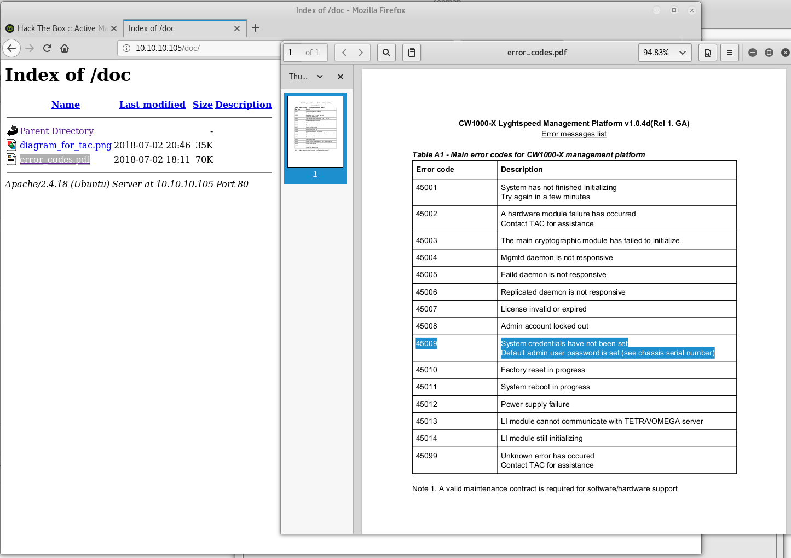

 6. Port 161 gibt Hinweise auf SNMP Protokoll. Es wird im Internet nach einer Methode zum erstellen von Requests gesucht.

    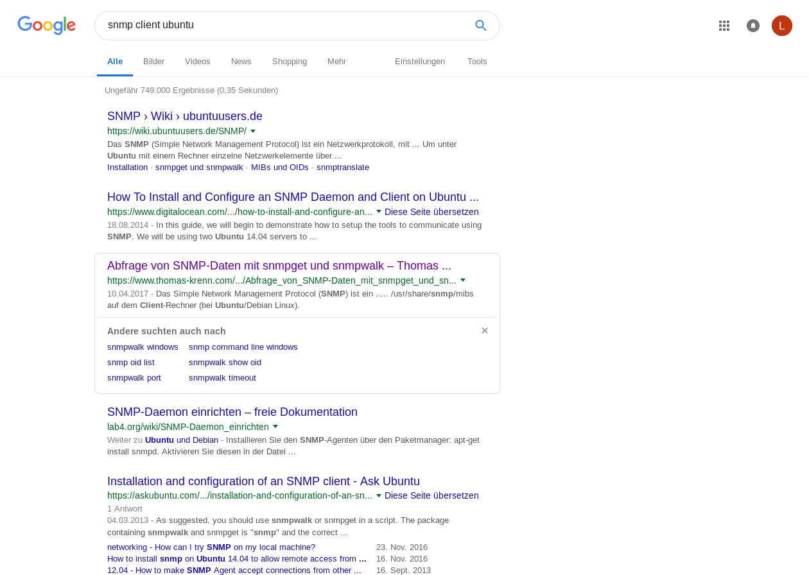

 7. Mit dem Tool snmpwalk (bei Kali vorinstalliert), lässt sich ein Request erstellen. Dieser liefert die Seriennummer des SNMP-Servers. Aus den Fehlercodes wissen wir, dass dies das Default Password für den Login Bereich ist. (Nutzername: admin, Passwort: NET_45JDX23)

    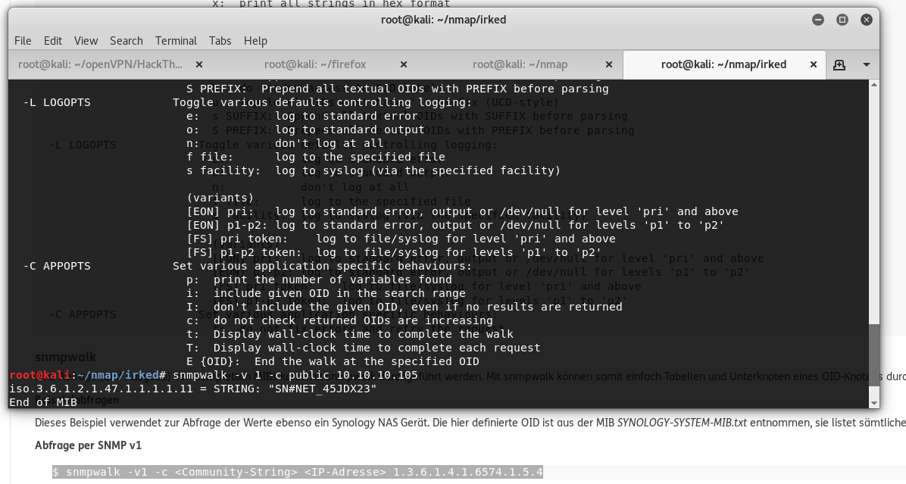

 8. Im Admin Bereich unter dem Reiter "Diagnostics" kann der Status des Dienstes verifizieren. Die Antwort lässt vermuten, dass es sich dabei um Kommandozeilencode handelt. Der Request wird mit "Burp" abgefangen und analysiert.

    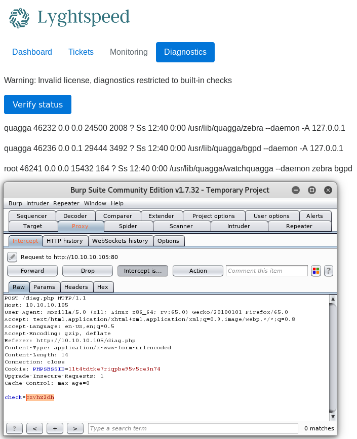

 9. Request wird an Repeater gesendet (strg+R oder copy paste), damit er verändert und mehrfach ausgeführt werden kann.

    

 10. Dekodiert man den Wert hinter "check" mit Base64, erhält man "quagga". Die Vermutung, dass hier Code ausgeführt werden kann, verstärkt sich. Es wird ein Testbefehl angehängt um sicher zu gehen.

    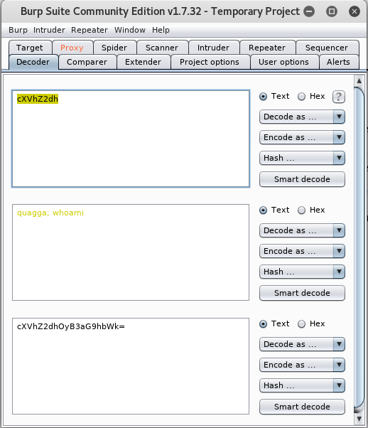

 11. Der Befehl wird getestet und Remote Code Execution Vulnerability festgestellt.

    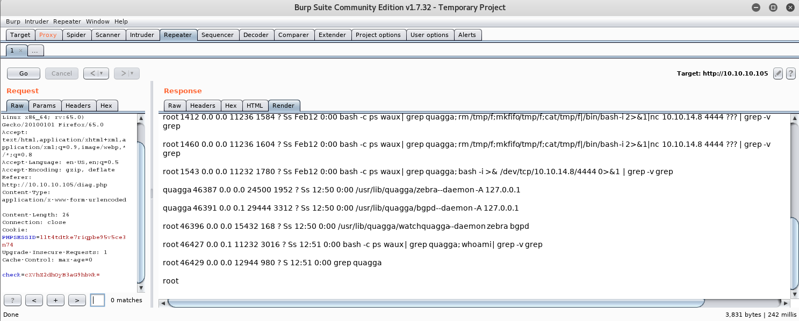

 12. Es wird anschließend nach Code zum erstellen einer Reverse Shell gesucht.

    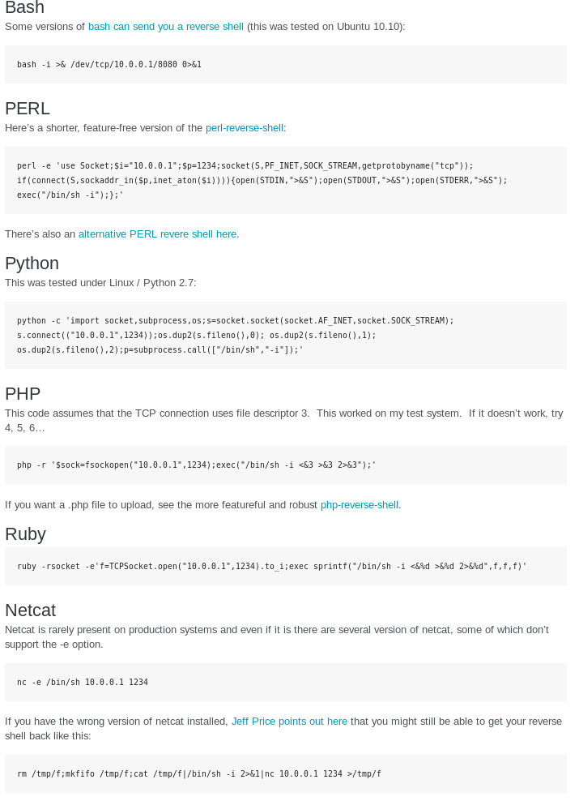

 13. Der Befehl für die Shell wird eingefügt und mit Base64 kodiert.

    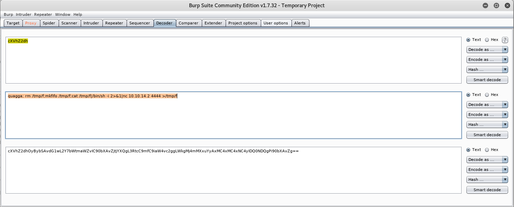

 14. Zum Schluss wird nur noch ein Listener erstellt (nc -nvlp 444), welcher die Reverse Shell empfängt. 

    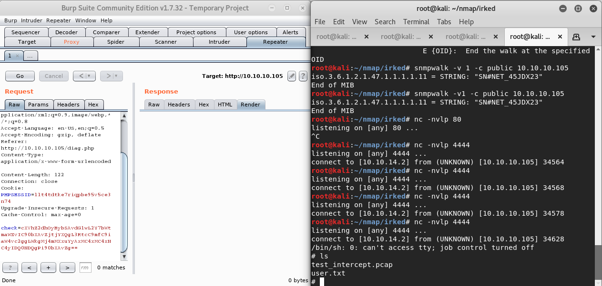

