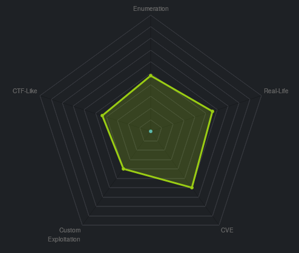
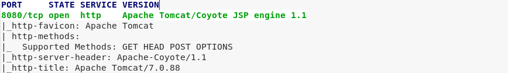
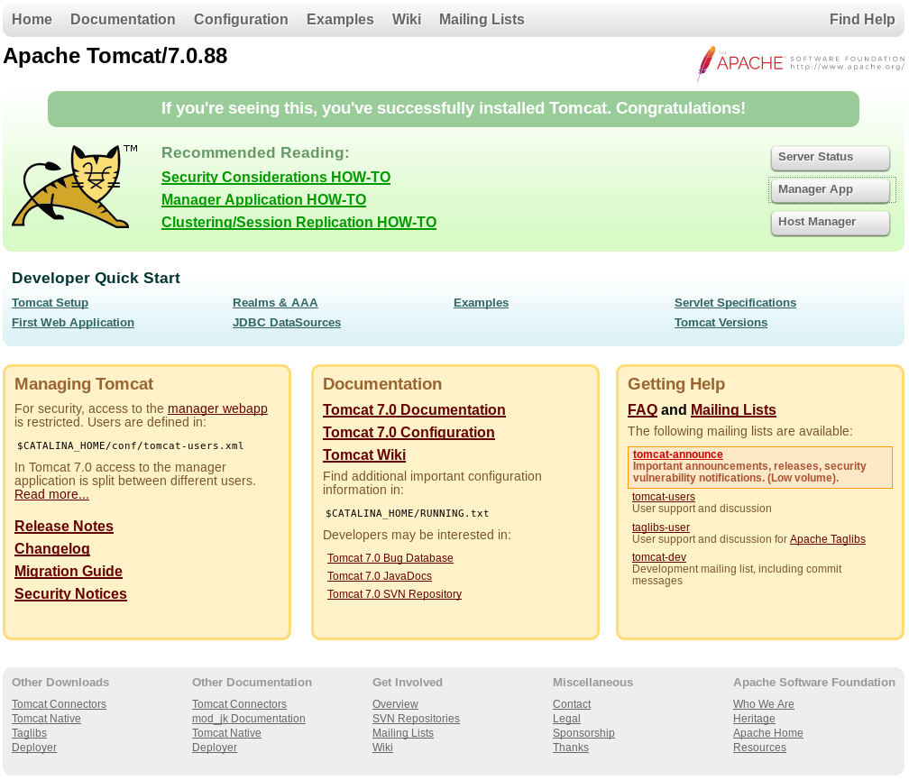
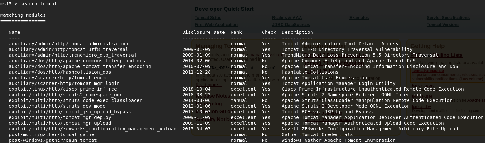
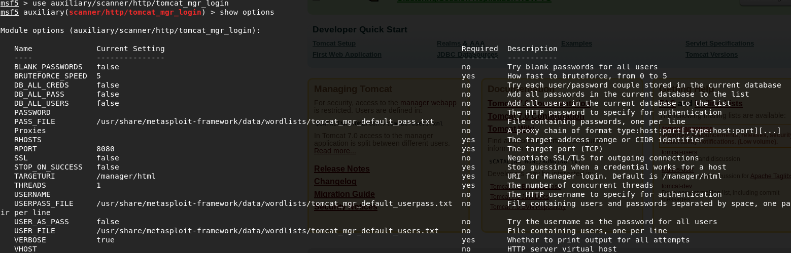
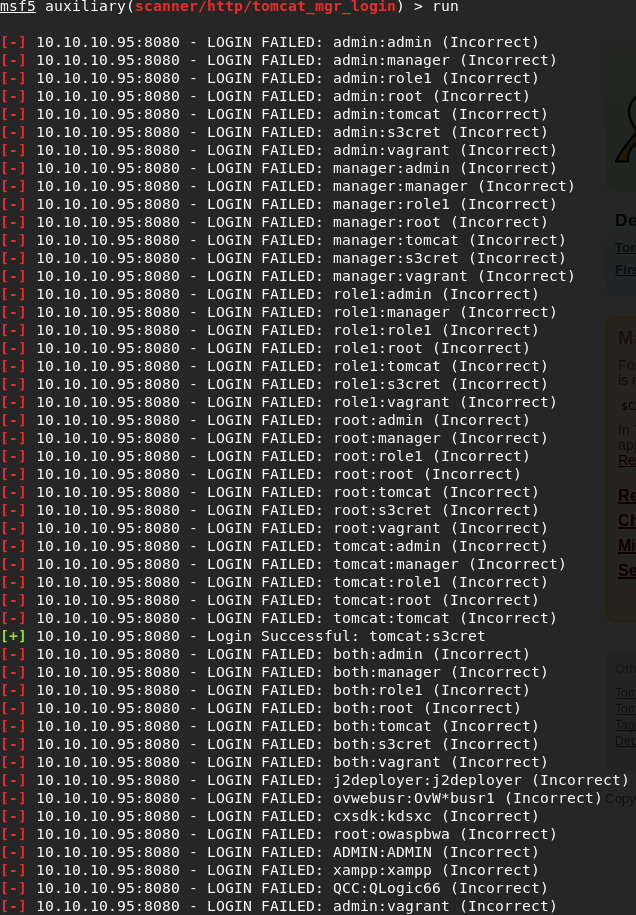

# 	Giddy

 Ein kurzes Tutorial für die Maschine "Jerry" von hackthebox.eu

 https://www.hackthebox.eu/home/machines/profile/144

Die Maschine lehrt den Umgang mit Metasploit Modulen. Alternativ kann der Bruteforce Angriff manuell über Hydra durchgeführt werden.

Einschätzung:


 
## Anleitung


 1. NMAP Scan 

    


 2. Besuch auf Port 8080... Manager App ist mit Nutzername und Passwort geschützt.

    

 3. Es wird nach passenden Metasploit Modulen für Apache Tomcat Server gesucht.

    

 4. Mit Hilfe eines Wörterbuchangriffs werden die Standard-Credentials ausprobiert. Dabei wird vorausgesetzt, dass das Logging von Fehlversuchen deaktiviert ist oder garnicht erst implementiert wurde.

    

    Alternativ kann der Bruteforce Angriff auch mit Hydra durchgeführt werden.
    ```bash
    hydra -C /usr/share/seclists/Passwords/Default-Credentials/tomCat-betterdefaultpasslist.txt http://10.10.10.95:8080/manager/html
    ```

 5. Der Scan liefert ein positives Ergebnis. Username:tomcat Passwort:s3cret
    

