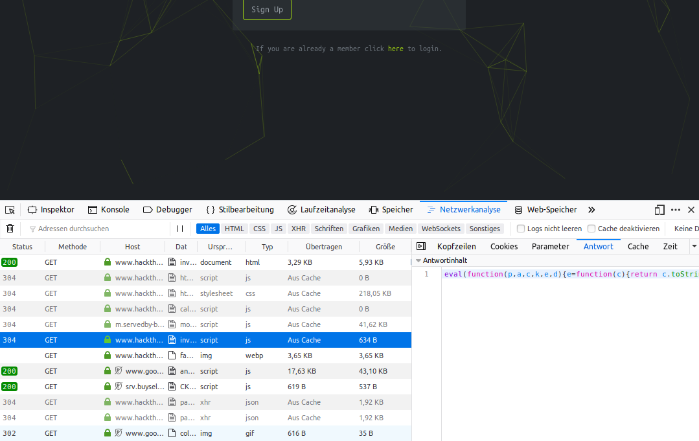
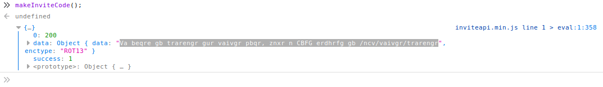
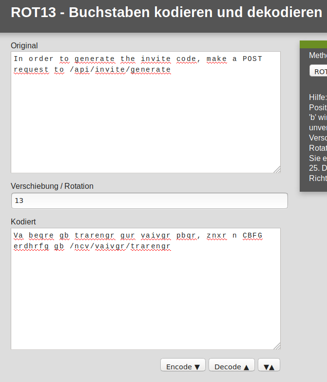

# 	InviteCode

Um sich bei HackTheBox anmelden zu können, muss zuerst der Invite Code über die Webseite gehackt und in folgenden Link eingegeben werden.

 https://www.hackthebox.eu/invite

## Anleitung

Now a nested list:

 1. Öffne das Netzwerkanalysetool deines Browsers. (Firefox: Strg + Umschalt + E)


 2. Aktualisiere die Seite


 3. Analysiere das markierte Paket der angefragten Adresse mit einem Code Beautifyer deiner Wahl.

    Code:
    
    ```javascript
    function verifyInviteCode(code) {
    var formData = {
        "code": code
    };
    $.ajax({
        type: "POST",
        dataType: "json",
        data: formData,
        url: '/api/invite/verify',
        success: function(response) {
            console.log(response)
        },
        error: function(response) {
            console.log(response)
        }
    })
    }

    function makeInviteCode() {
    $.ajax({
        type: "POST",
        dataType: "json",
        url: '/api/invite/how/to/generate',
        success: function(response) {
            console.log(response)
        },
        error: function(response) {
            console.log(response)
        }
    })
    }
    ```
    
 4. Funktion makeInviteCode() in Console eingeben
   
 5. Nachricht mit angegebener Methode Dekodieren.
    
 6. POST Request mit (unter Kali Linux) mit CURL erstellen:
    ```bash
        curl -XPOST https://www.hackthebox.eu/api/invite/generate
    ```
 7. Antwort mit angegebener Methode (tendentiell Base64) dekodieren.
    
    
    

